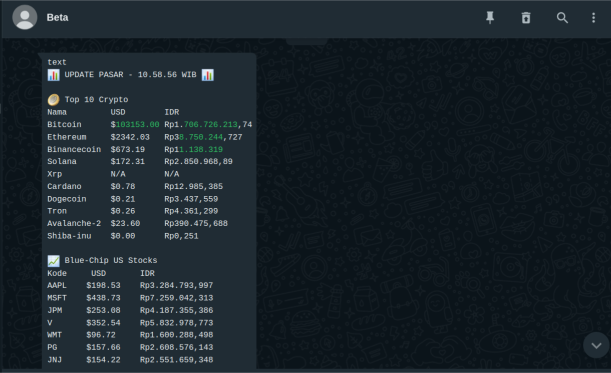

# Crypto-Curr Bot



Crypto-Curr Bot adalah aplikasi Node.js yang mengirimkan pembaruan real-time tentang harga cryptocurrency, saham blue-chip AS, logam mulia, kurs mata uang, dan cuaca di kota-kota Indonesia (Jakarta, Surabaya, Bandung, Denpasar) melalui WhatsApp setiap menit. Bot ini dirancang untuk trader, UMKM logam mulia, dan komunitas keuangan di Indonesia, dengan fokus pada data lokal (kurs IDR, cuaca kota besar).

## Fitur
- **Harga Cryptocurrency**: Top 10 koin (Bitcoin, Ethereum, dll.) dari CoinGecko.
- **Harga Saham**: 10 saham blue-chip AS (Apple, Microsoft, dll.) dari Finnhub.
- **Harga Logam Mulia**: Emas, perak, platinum, paladium dari MetalpriceAPI.
- **Kurs Mata Uang**: USD ke EUR, GBP, JPY (ExchangeRate-API) dan IDR (CoinGecko).
- **Cuaca Lokal**: Suhu dan kondisi cuaca di Jakarta, Surabaya, Bandung, Denpasar dari OpenWeatherMap.
- **Otomatisasi WhatsApp**: Kirim pembaruan ke nomor/grup WhatsApp menggunakan `whatsapp-web.js`.
- **Efisiensi API**: Cache 5 menit (10 menit untuk MetalpriceAPI) untuk mematuhi batasan rate limit.
- **Deployment**: Dioptimalkan untuk AWS EC2 dengan konfigurasi headless browser.

## Prasyarat
- **Node.js**: Versi 16 atau lebih tinggi (`node -v`).
- **AWS EC2**: Instance Ubuntu (misalnya, t2.micro) dengan akses SSH.
- **WhatsApp**: Nomor aktif untuk autentikasi via QR code.
- **API Keys**:
  - [Finnhub](https://finnhub.io/) (saham, gratis, 60 permintaan/menit).
  - [MetalpriceAPI](https://metalpriceapi.com/) (logam mulia, gratis, 100 permintaan/bulan).
  - [ExchangeRate-API](https://www.exchangerate-api.com/) (kurs, gratis, 1500 permintaan/bulan).
  - [OpenWeatherMap](https://openweathermap.org/) (cuaca, gratis, 1 juta permintaan/bulan).
  - CoinGecko (crypto, gratis, tanpa API key, ~30 permintaan/menit).

## Instalasi
1. **Clone Repository** (jika menggunakan Git, atau buat direktori manual):
   ```bash
   git clone https://github.com/fico-aditama/whatsapp-api-notification crypto-curr
   cd crypto-curr
   ```
   Atau:
   ```bash
   mkdir crypto-curr
   cd crypto-curr
   ```

2. **Inisialisasi Proyek**:
   Buat `package.json`:
   ```json
   {
     "name": "crypto-curr",
     "version": "1.0.0",
     "type": "module",
     "scripts": {
       "start": "xvfb-run node crypto-curr.js"
     },
     "dependencies": {
       "axios": "^1.7.2",
       "whatsapp-web.js": "^1.23.0",
       "qrcode-terminal": "^0.12.0",
       "dotenv": "^16.4.5"
     }
   }
   ```

3. **Instal Dependensi Node.js**:
   ```bash
   npm install
   ```

4. **Instal Dependensi Sistem di EC2** (untuk `whatsapp-web.js` dan Chromium):
   ```bash
   sudo apt-get update
   sudo apt-get install -y \
     ca-certificates fonts-liberation libappindicator3-1 libasound2 libatk-bridge2.0-0 \
     libatk1.0-0 libc6 libcairo2 libcups2 libdbus-1-3 libexpat1 libfontconfig1 \
     libgbm1 libgcc1 libglib2.0-0 libgtk-3-0 libnspr4 libnss3 libpango-1.0-0 \
     libpangocairo-1.0-0 libstdc++6 libx11-6 libx11-xcb1 libxcb1 libxcomposite1 \
     libxcursor1 libxdamage1 libxext6 libxfixes3 libxi6 libxrandr2 libxrender1 \
     libxss1 libxtst6 lsb-release wget xdg-utils xvfb chromium-browser
   ```

5. **Konfigurasi DNS di EC2** (untuk menghindari error `ENOTFOUND`):
   ```bash
   sudo bash -c 'echo "nameserver 8.8.8.8" >> /etc/resolv.conf'
   sudo bash -c 'echo "nameserver 1.1.1.1" >> /etc/resolv.conf'
   ```

## Konfigurasi
1. **Buat File `.env`**:
   Di direktori proyek, buat file `.env`:
   ```env
   FINNHUB_API_KEY=your_finnhub_key
   METALPRICE_API_KEY=your_metalprice_key
   EXCHANGE_RATE_API_KEY=your_exchangerate_key
   OPENWEATHER_API_KEY=your_openweather_key
   WHATSAPP_TO=6281234567890@c.us
   CITIES=Jakarta,Surabaya,Bandung,Denpasar
   ```
   Ganti `your_..._key` dengan API key yang sesuai dan `WHATSAPP_TO` dengan nomor tujuan (format: `628xxxxxxxxxx@c.us`).

2. **Amankan File `.env`**:
   ```bash
   chmod 600 .env
   ```

3. **Tambahkan `.env` ke `.gitignore`** (jika menggunakan Git):
   ```gitignore
   .env
   ```

## Penggunaan
1. **Jalankan Bot**:
   ```bash
   npm start
   ```
   Atau langsung:
   ```bash
   xvfb-run node crypto-curr.js
   ```

2. **Autentikasi WhatsApp**:
   - Saat pertama kali dijalankan, bot akan menampilkan QR code di terminal.
   - Buka WhatsApp di ponsel, masuk ke **Settings > Linked Devices > Link a Device**, dan scan QR code.
   - Setelah autentikasi, bot akan mengirim pembaruan setiap menit ke nomor/grup yang ditentukan di `WHATSAPP_TO`.

3. **Output**:
   - Pembaruan akan dikirim ke WhatsApp dan ditampilkan di terminal, berisi:
     - Harga top 10 cryptocurrency (USD dan IDR).
     - Harga 10 saham blue-chip AS (USD dan IDR).
     - Harga logam mulia (emas, perak, platinum, paladium).
     - Kurs USD ke EUR, GBP, JPY, dan IDR.
     - Cuaca di Jakarta, Surabaya, Bandung, Denpasar.

   **Contoh Output**:
   ```
   📊 *Update Pasar (Terakhir diperbarui: 14:45:30)* 📊
   *Top 10 Cryptocurrencies*
   Bitcoin: $60,123.45 | Rp1,013,497,123
   Ethereum: $2,456.78 | Rp41,422,456
   ...

   *Top 10 Saham Blue-Chip US*
   AAPL: $220.45 | Rp3,715,123
   MSFT: $415.67 | Rp7,005,456
   ...

   *Harga Logam Mulia (per troy ons)*
   Emas: $2,400.00 | Rp40,456,800
   ...

   *Kurs Mata Uang (Base: USD)*
   USD/EUR: 0.9200
   USD/IDR: Rp16,857
   ...

   *Cuaca*
   Jakarta: Suhu: 28°C, Kondisi: Cerah
   Surabaya: Suhu: 30°C, Kondisi: Berawan
   ...
   ```

## Batasan API
- **CoinGecko**: ~30 permintaan/menit, aman dengan cache 5 menit (~24 permintaan/hari).
- **Finnhub**: 60 permintaan/menit, aman (~120 permintaan/hari).
- **MetalpriceAPI**: 100 permintaan/bulan, aman dengan cache 10 menit (~144 permintaan/bulan).
- **ExchangeRate-API**: 1500 permintaan/bulan, aman (~288 permintaan/bulan).
- **OpenWeatherMap**: 1 juta permintaan/bulan, aman (~1152 permintaan/bulan).

## Troubleshooting
- **QR Code Tidak Muncul**:
  - Pastikan dependensi sistem terinstal (langkah 4 instalasi).
  - Cek log error di terminal.
  - Uji Chromium:
    ```bash
    chromium-browser --version
    ```
- **Error `ENOTFOUND`**:
  - Uji koneksi API:
    ```bash
    curl 'https://api.coingecko.com/api/v3/simple/price?ids=bitcoin&vs_currencies=usd'
    curl 'https://finnhub.io/api/v1/quote?symbol=AAPL&token=YOUR_KEY'
    ```
  - Pastikan DNS dikonfigurasi (langkah 5 instalasi).
- **Pesan Tidak Terkirim**:
  - Pastikan `WHATSAPP_TO` benar (format: `628xxxxxxxxxx@c.us`).
  - Cek status client: `console.log(client.info)` setelah `ready`.
- **API Gagal**:
  - Verifikasi API key di `.env`.
  - Uji endpoint dengan `curl` (lihat di atas).

## Kontribusi
- Laporkan bug atau saran di [Issues](#) (ganti dengan URL repo jika ada).
- Tambahkan fitur seperti alert kustom atau analitik dengan Pull Request.

## Lisensi
MIT License. Lihat [LICENSE](#) untuk detail.

## Kontak
Dikembangkan oleh [Fiko]. Hubungi via [fico.aditama31@gmail.com] atau WhatsApp untuk dukungan.